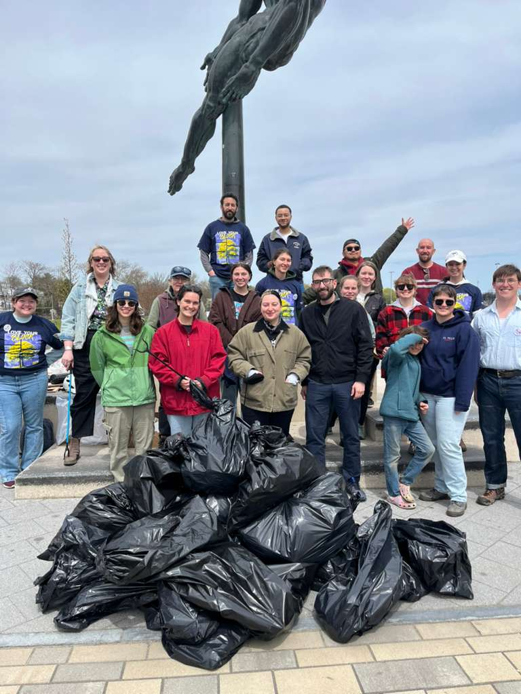
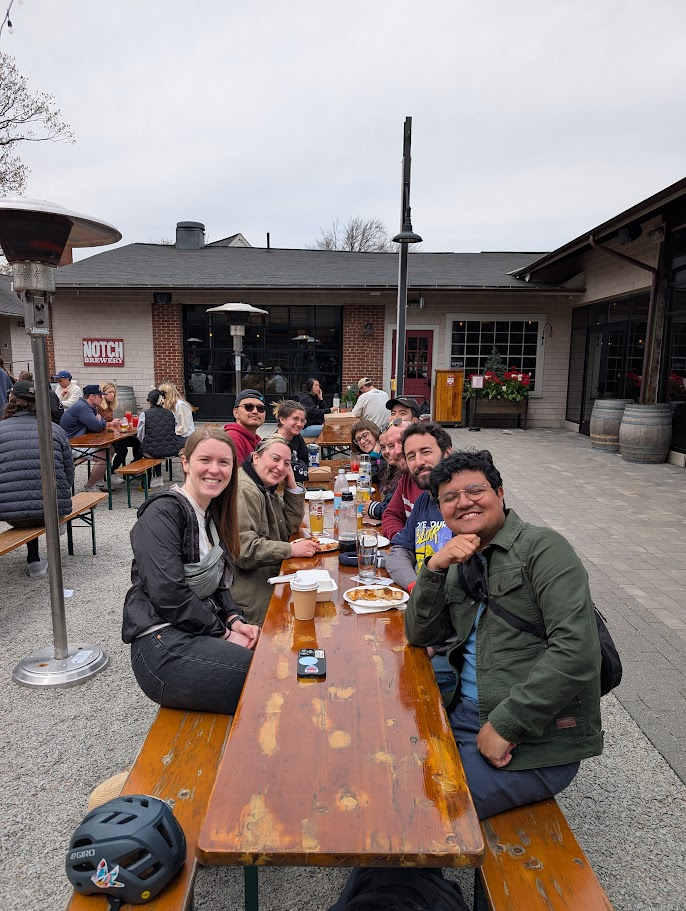

For the second consecutive year, we hosted a cleanup at Smith Park as part of Boston’s annual Love Your Block initiative! On a crisp April morning, more than 20 ABHA members gathered to clear litter and support our local green spaces.

And the day didn’t end at the park! After filling roughly a dozen trash bags, we walked and biked down to the Speedway courtyard to cap off the event. We enjoyed an afternoon of beers, pizza, and building connections among dedicated housing advocates.

