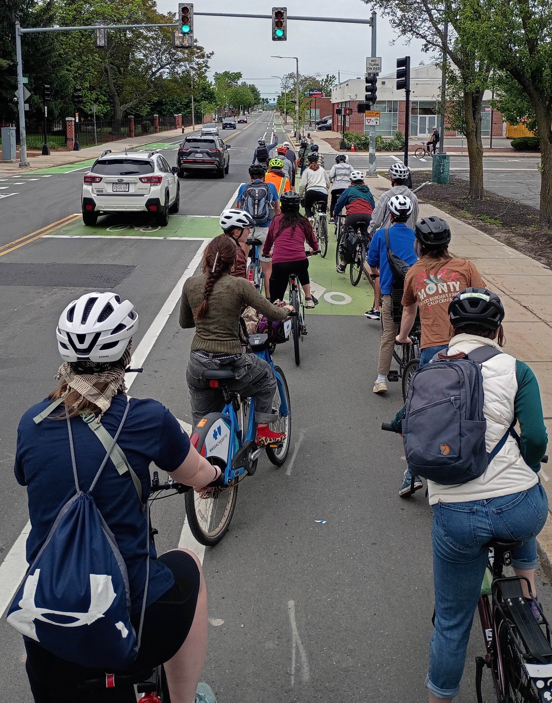
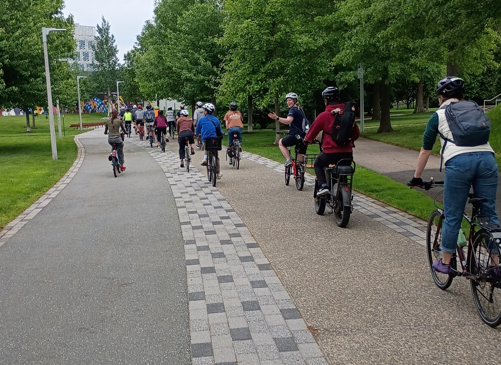

On Saturday, May 23rd, ABHA members and friends gathered for a bike ride through Allston-Brighton to advocate for safer streets in our neighborhood. The ride was a great way to connect with ABHA members and new faces alike while raising awareness about the need for improved streetscapes that prioritize safety and accessibility.

We decided on this specific route to draw attention to the current state of our protected bike lane network. Over the winter, plowing operations destroyed many of the protective flexposts along our route. Months later, those posts have not been replaced, leaving cyclists entirely exposed to vehicle traffic. We rode to increase the noise on this issue and show the city that our neighborhood expects better.

A huge thank you to our ride volunteers and everyone who came out to pedal with us. If you couldn't make it but want to help, please use the **Boston 311** app to report missing flexposts in the neighborhood! The more individual tickets the city receives, the harder it is to ignore the demand for safe streets.

