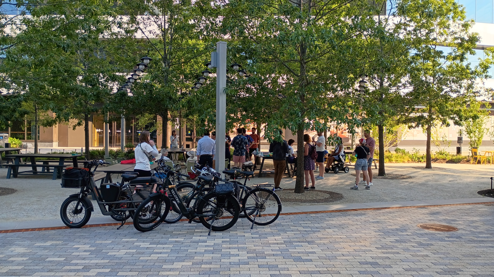
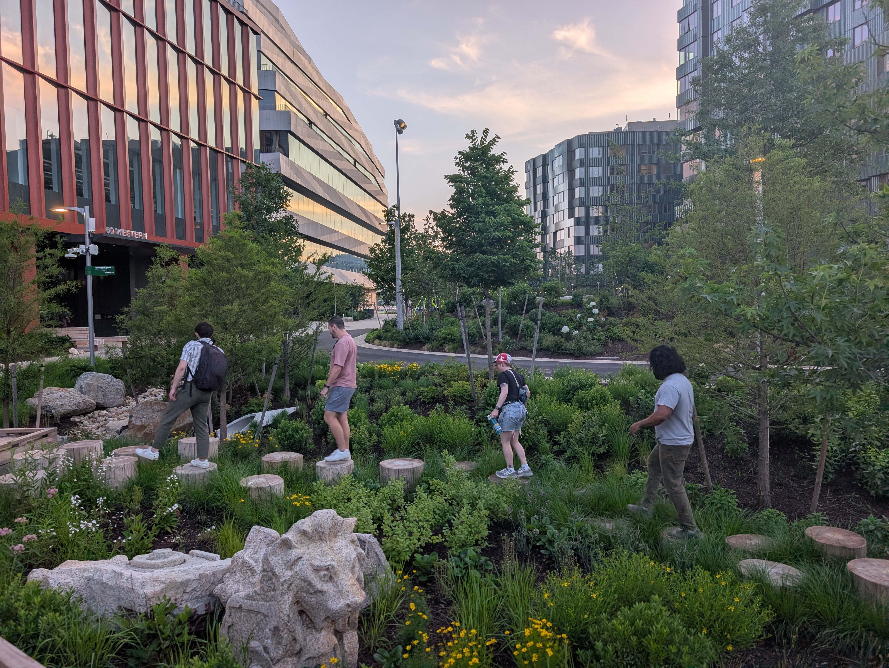
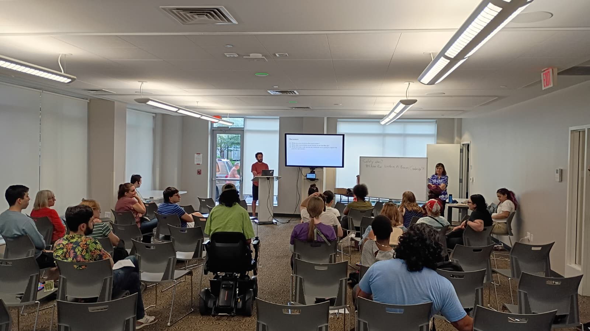

ABHA has been keeping busy this summer! In June, we took our usual meeting outdoors to celebrate the opening of the Allstonway, the newest public pedestrian plaza in the neighborhood. Allstonway is part of Harvard's Enterprise Research Campus along Western Ave, and we heard from advocates who worked with Harvard to ensure their development would include community centered public spaces like this one. We also heard from a developer from Tishman Speyer who shared insights on how developers work with local task forces and community groups to incorporate community benefits into their projects.

After the meeting, we explored the rest of the Allstonway plaza, appreciating the public art, rock formations, stone lion heads, and the wetland rain garden. The entire space is a thoughtfully curated environment that blends natural and artistic elements to create a welcoming public area for the community. We highly encourage everyone to check it out!

In July, we returned to our usual indoor meeting format, where we discussed two topical items: the recent pushes for increased safe street initiatives across the city, and the release of the [Neighborhood Housing zoning districts](https://www.bostonplans.org/neighborhood-housing).

As a group, we've been disappointed at the city's lack of progress in making our streets safer for more than a year now. We talked about strategies for advocating more effectively, which we hope to implement in the coming months to push for meaningful change in our neighborhood.

We spent the second half of the meeting learning about the new Neighborhood Housing zones and how they impact the neighborhoods they were mapped onto. We also considered what they mean for Allston-Brighton - they will likely be part of the overall zoning map when the Allston-Brighton Community Plan draft zoning is released later this year.

