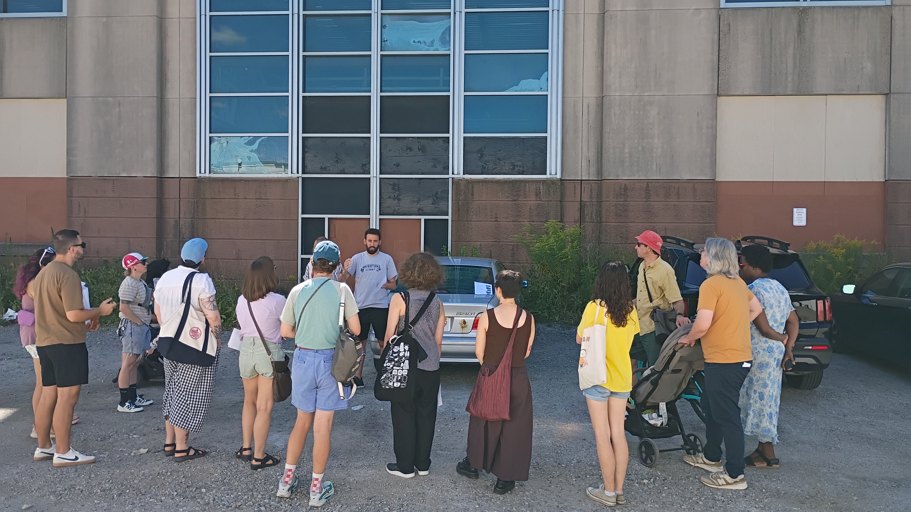
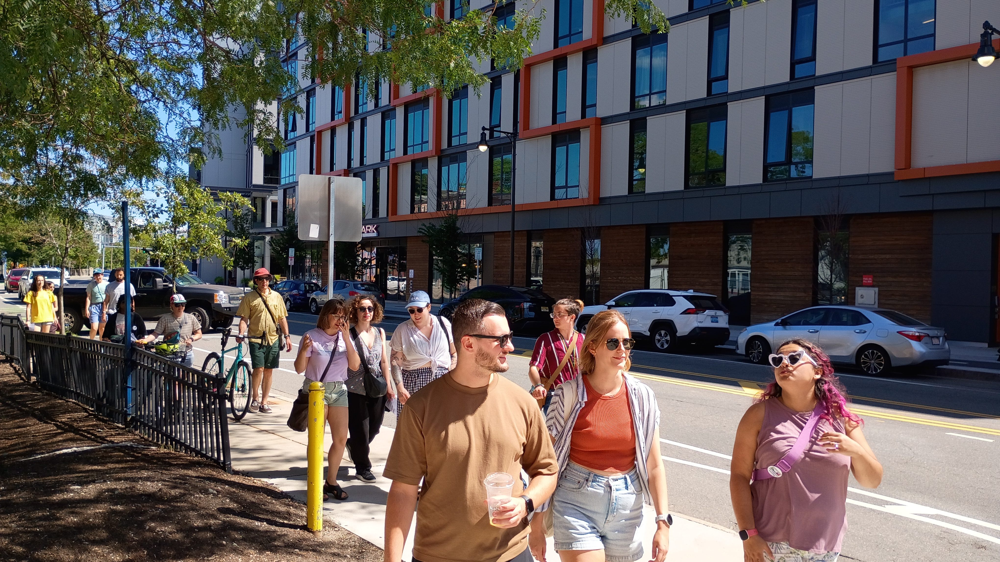
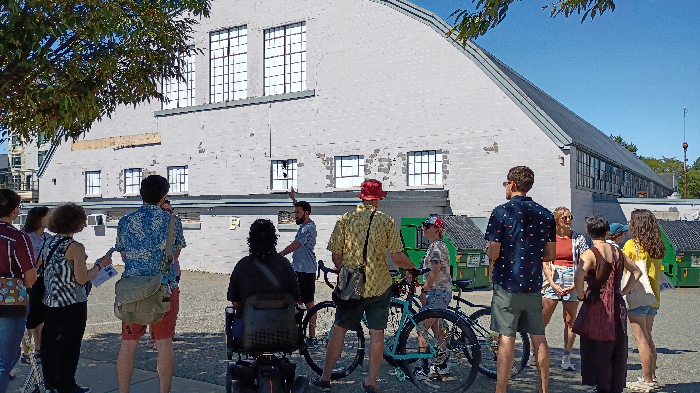
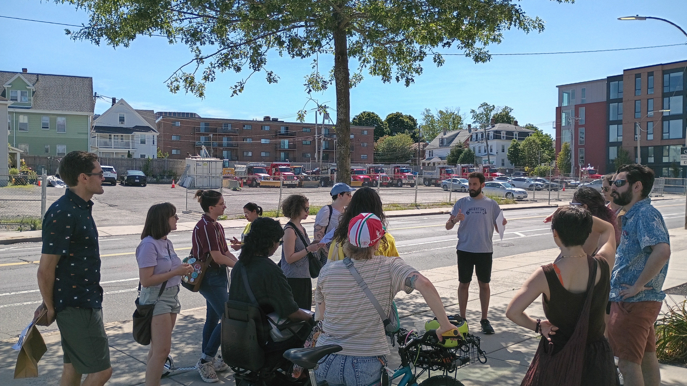

# Tour Notes

### 176 Lincoln Street

- Carnegie Steel Company Warehouse as early as 1916, but abandoned by the 80s
- Set to become a state of the art data center around 2000, then the dotcom bubble burst
- Redevelopment plans approved in 2023, with offices, lab space, and residential
- Plans stalled again as demand for offices and lab space fell
- Very recently proposed to develop just the residential portion \- with a reconfigured mix of affordable units and a scaled down parking garage

### Barry’s Corner (180 Western Ave)

- A small neighborhood, razed in the late 60s by the Boston Redevelopment Authority
- Residents protested the plan to turn their neighborhood into a large luxury apartment complex, but were largely unsuccessful
- Proposal in 2020 to replace the lot with a new residential building and retail space, approved in 2023
- No updates since 2023

### Allumination Mural (273 Western Ave)

- Former mattress supply store, Bonnie Foam Rubber
- Turned into a mural by the Harvard-funded Zone 3 program
- No current plans for development on the site

### Skating Club (1240 Soldiers Field Road)

- Club was established in 1912, and used this building as their home from 1938-2020
- Original plan to relocate to Lincoln St didn’t work out
- Club built a new rink in Norwood and sold this site to a local real estate company
- Ambitious housing project (14+ stories\!) was proposed in 2020, and approved in 2023
- No updates since 2023 \- despite extra money being allocated through the state’s “Momentum Fund”

### 500 Western Ave

- Formerly an Irving gas station
- Plans to build a 6 story, 116-unit apartment building with 133 parking spaces (64 as “district parking”)
- Only site being developed by the individual owner
- No updates since 2023 \- high cost of constructing a multi-level parking garage a likely reason

#### Resources

- Atlascope \- http://www.atlascope.org/
- Boston Planning Department \- https://www.bostonplans.org
- Brighton-Allston Historical Society \- https://www.bahistory.org/
- Universal Hub \- https://www.universalhub.com/
