# Meeting Agenda and Notes

- Introductions
- Recent and Upcoming Events
  - Thank you to everyone who helped table or who came to talk with us at Allston-Brighton Open Streets on October 4
  - Urbanism Reading Group: Sunday October 11, 1 PM, Molly's Bookstore, reading Neighborhood Defenders by Katherine Levine Einstein, David M. Glick, and Maxwell Palmer
  - Coffee Hour: Sunday October 18, Noon - 2 PM, Cafe Lava and Bento in Brighton Center
  - Tour de Streets: A bike ride fundraiser for Livable Streets, Saturday October 24, 10:30 AM - 2:30 PM, [register or donate to the ABHA team here](https://secure.qgiv.com/event/tourdestreets2026/team/1045069/)
- Bike Lane Meeting
  - Mayor Wu, Chris Osgood, Tali Robbins, and several other city staffers met with local cycling advocates to discuss the state of the bike lane network, both in the short term and longer term improvements to be included in the Allston-Brighton Community Plan
  - Promised flexposts on Western Ave back sometime this fall, but no specific date given
  - Speed humps coming to Parsons and Glenville, also likely this fall
  - How do we hold the city accountable on these promises?
  - Medium/Longer term updates:
    - Bike path along Lincoln St as Eversouce does utility work
    - Carriage road restructuring along the Southern side of Comm Ave
    - A protected North/South connection along Market/Chestnut Hill
  - See below for slides from the city
- Scofflaw Landlords
  - Veniece Miller from Councilor Liz Breadon's office talked about the new initiative to hold landlords to a higher standard of accountability and to publish the results publicly
  - Lots of discussion on how to make sure the program is effective and trustworthy
  - Submit your [bad landlord horror stories here](https://btqyhbdsjch.typeform.com/badlandlords)
- Tax Abatements
  - Explanation of the mechanism by which the city of Boston wants to jump start several stalled development projects in Allston-Brighton by offering tax abatements to developers
  - City is not forgoing any tax revenue, but rather delaying a portion of it for a period of time
  - Comment periods for each project are open now - we encourage members to submit comments in support
    - [22-24 Pratt St](https://www.bostonplans.org/projects/development-projects/22-24-pratt-street)
    - [83 Leo Birmingham Pkwy](https://www.bostonplans.org/projects/development-projects/83-leo-m-birmingham-parkway)
    - [Allston Yards Building D](https://www.bostonplans.org/projects/development-projects/allston-yards-building-d)

## Allston-Brighton Bike Network Vision Draft Slides

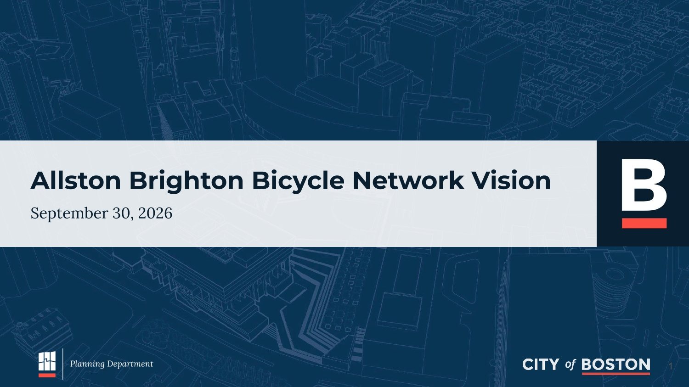
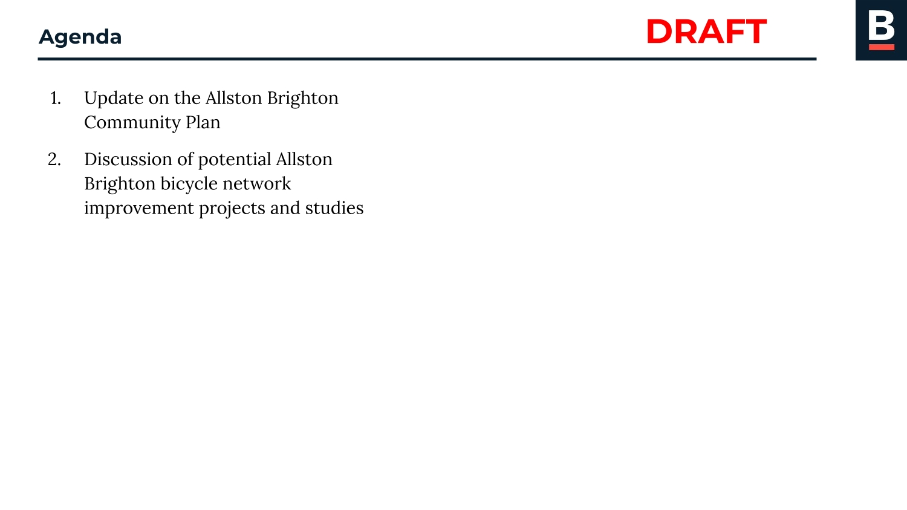
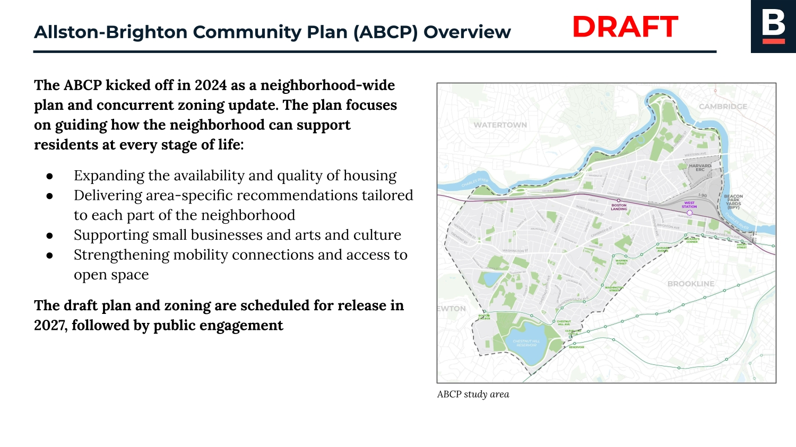
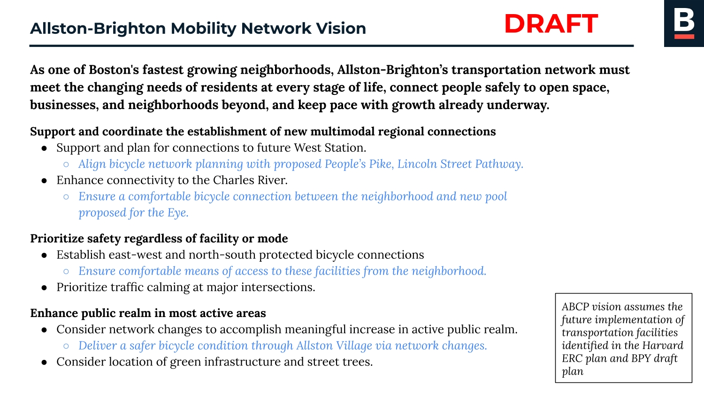
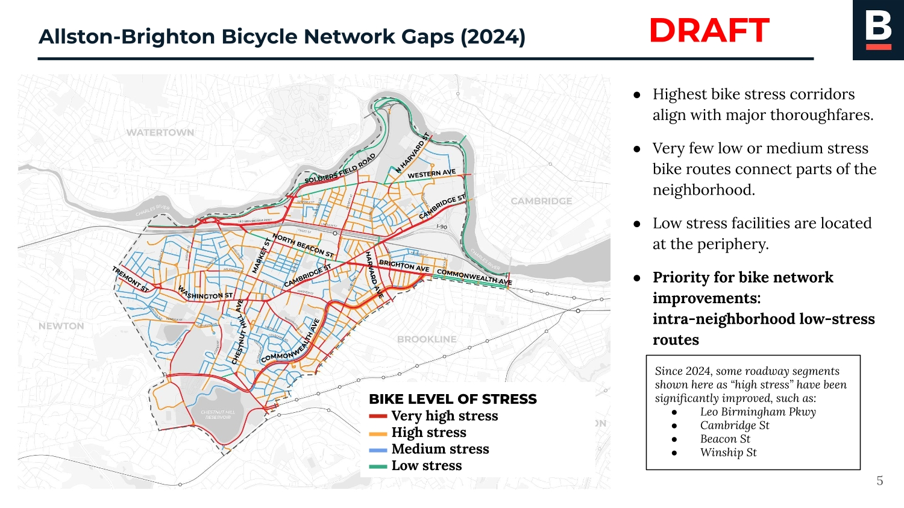
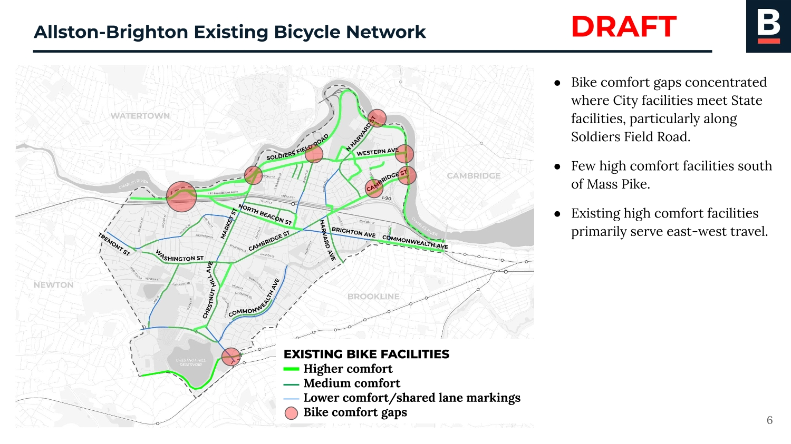
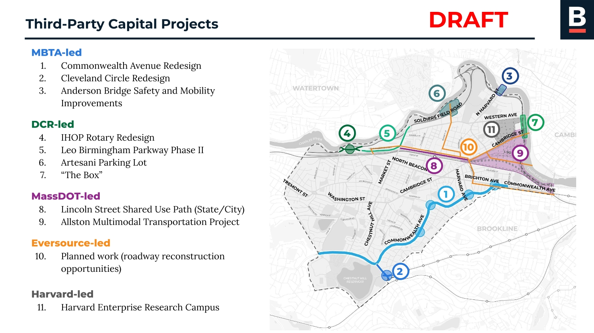
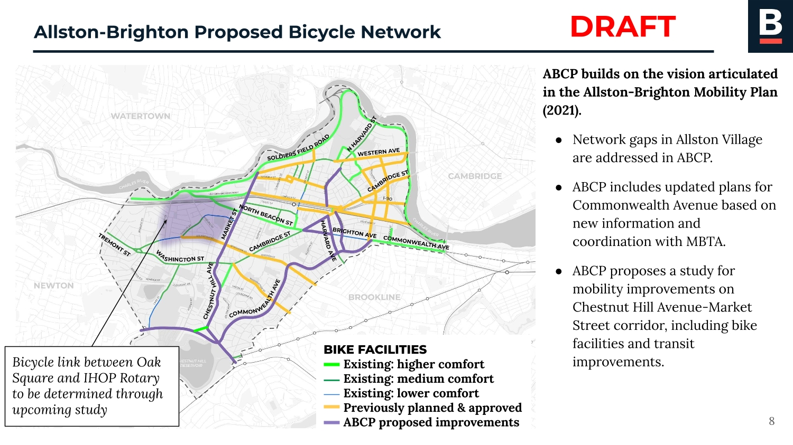
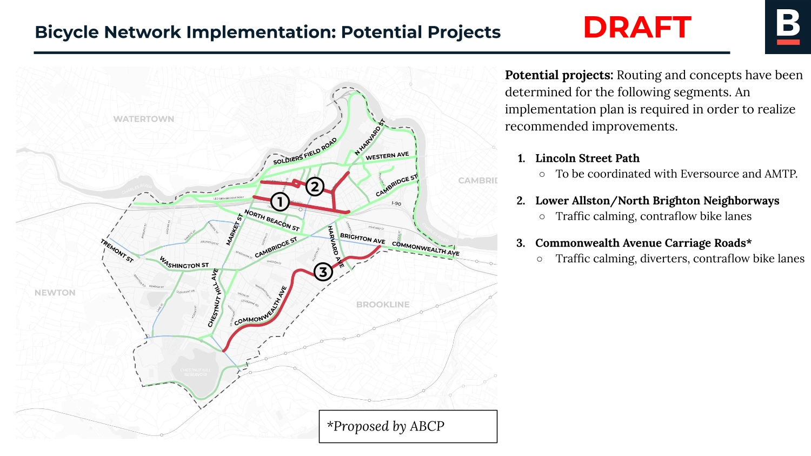
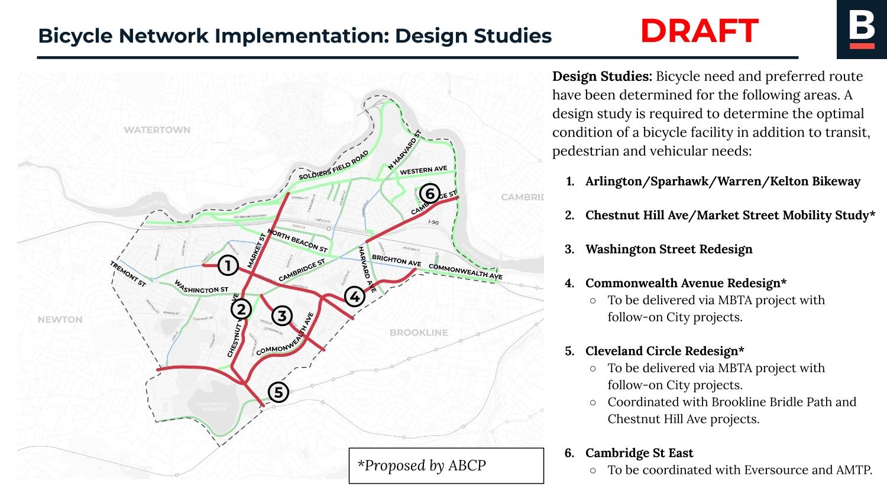
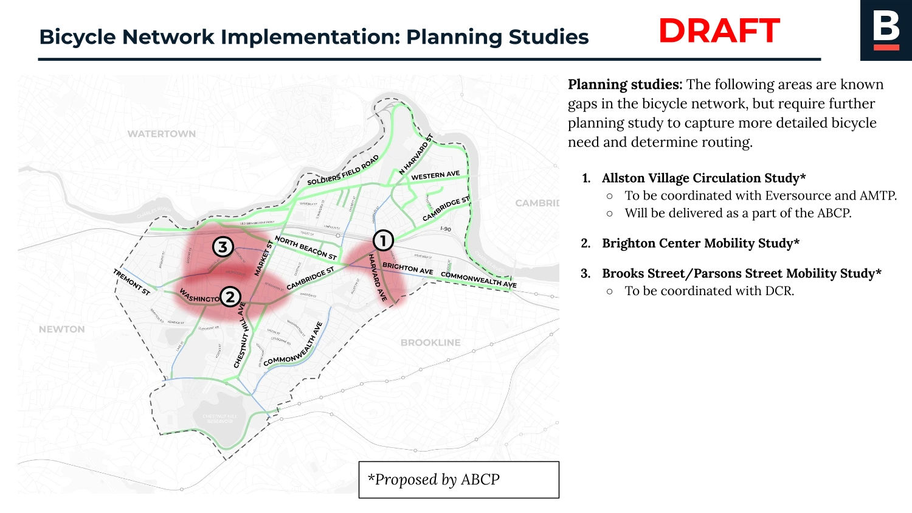
